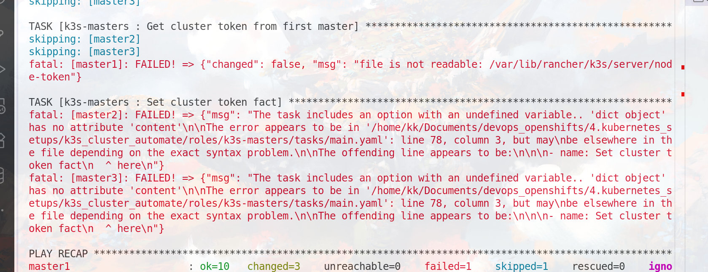

```bash 
ansible-playbook playbooks/iaC.yaml
```
## 1. Automate the LB
1. master 
2. backup 

- install haproxy keepalived 
- configure haproxy -> on both machines 
- configure keepalived.conf master , backup 


```BASH


cd /etc/haproxy 
more haproxy.cfg

ansible-playbook playbooks/loadbalancers.yaml
```


## CheckList 
- Loadbalancers 
    - HAProxy already configured 
    - Keepliaved 

## OUR ISSUES 
