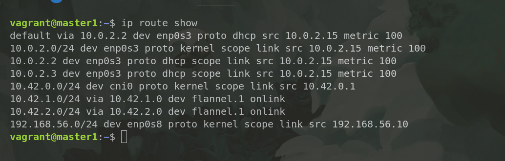
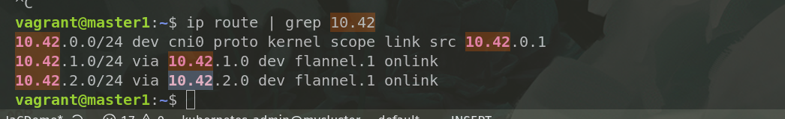

## NOTE 

```bash
mkdir -p $HOME/.kube
sudo cp /etc/rancher/k3s/k3s.yaml $HOME/.kube/config
sudo chown $(id -u):$(id -g) $HOME/.kube/config

export KUBECONFIG=$HOME/.kube/config
kubectl get nodes

```
1. Fixing the clusterip issues 

- K3s used flannel
```bash
kubectl get nodes -o wide 
kubectl get pod -A -o wide 
```
Check if : 
- Pods are evenly distributed across all 3 masters 
- Pods IPs are reachable between nodes ( can test with ping from inside the pod) 

Result: 
- only able to ping the IP of the master1

```bash
kubectl get pods -n kube-system -o wide | grep flannel

#To change the container network
# if it emptyy , it means that the flannel is not installed 
sudo ls /var/lib/rancher/k3s/agent/etc/cni/net.d/
# 10-flannel.conflist

ls -l /var/lib/rancher/k3s/server/manifests/


# debug
ip route show 
```
- results from `ip route show` 



```bash 
# ensure that each node has unique podCIDR . Conflicts will breaks the flannel 
kubectl get nodes -o jsonpath="{range .items[*]}{.metadata.name} {.spec.podCIDR}{'\n'}{end}"
```

### RUN test 
```bash
kubectl apply -f - <<EOF
apiVersion: v1
kind: Pod
metadata:
  name: test-nginx
  labels:
    app: test-nginx
spec:
  containers:
  - name: nginx
    image: nginx
    ports:
    - containerPort: 80
---
apiVersion: v1
kind: Service
metadata:
  name: nginx-service
spec:
  selector:
    app: test-nginx
  ports:
    - protocol: TCP
      port: 80
      targetPort: 80
  type: ClusterIP
EOF

```

### ANALYZE THE ISSUE 

- Your master has rolutes to other pod networks, pointing via `flannel.1`
- That's expected in Flannel with VXLAN, but the **next hops** 10.42.x.0 are invalid IPs   
- Next hops should be a subnet , not IP 
```bash 
# What it should show 
10.42.1.0/24 via 10.0.0.2 dev flannel.1
# or 
10.42.1.0/24 dev flannel.1  proto kernel  scope link  src 10.42.1.1

```
> Note : flannel is not the pods running as daemonset , but it's the service embedded with the k3s binary. 


```
ip -o -4 addr show | grep -v " lo\|docker\|cni"
2: enp0s3    inet 10.0.2.15/24 metric 100 brd 10.0.2.255 scope global dynamic enp0s3\       valid_lft 72455sec preferred_lft 72455sec
3: enp0s8    inet 192.168.56.10/24 brd 192.168.56.255 scope global enp0s8\       valid_lft forever preferred_lft forever
65: flannel.1    inet 10.42.0.0/32 scope global flannel.1\       valid_lft forever preferred_lft forever
```
--flannel-iface=eth0